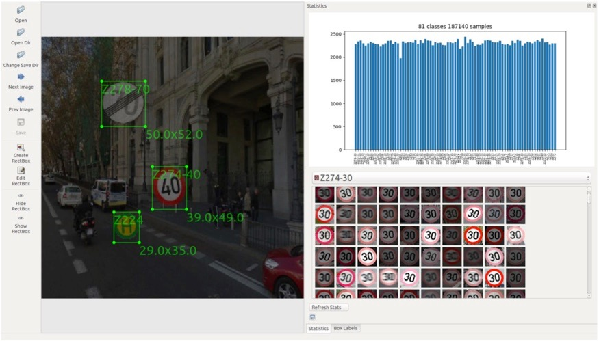

# DataSetGenerator

Generates Data for Object detection models

This project is currently in refactoring phase...

please be patient :)

the following picture shows the result of this data set generation tool.
I used it for my ssd for traffic sign detection and it works well :)

More Details and an use case for this tool: http://eugen-lange.de/german-traffic-sign-detection/

Demo of a model trained with generated data set:

